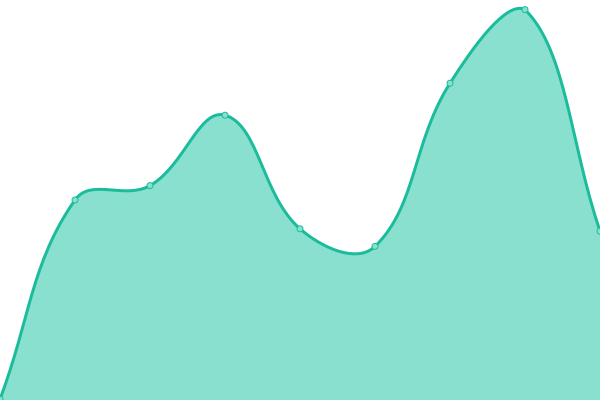
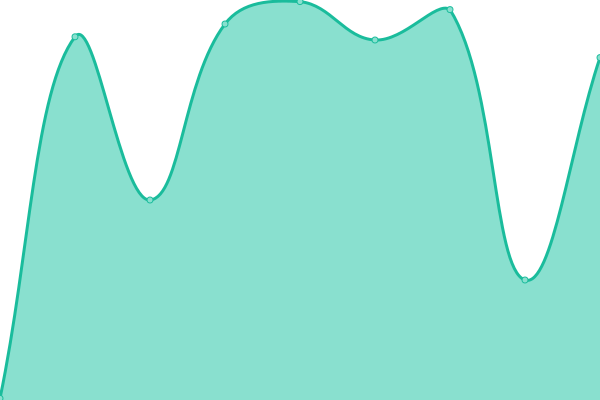
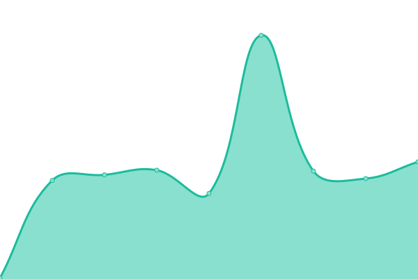
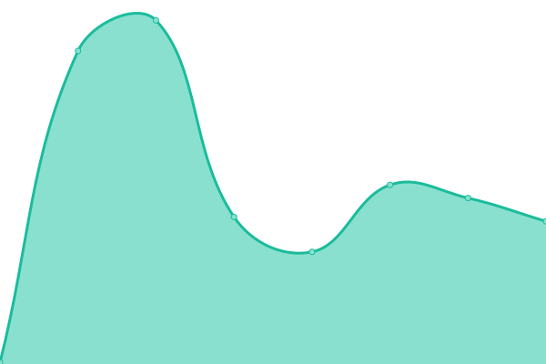

# [📈 Live Status](https://status.paion-data.dev): <!--live status--> **🟩 All systems operational**

This repository contains the open-source uptime monitor and status page for [Paion Data](https://nexusgraph.com/), powered by [Upptime](https://github.com/upptime/upptime).

With [Upptime](https://upptime.js.org), you can get your own unlimited and free uptime monitor and status page, powered entirely by a GitHub repository. We use [Issues](https://github.com/paion-data/service-status/issues) as incident reports, [Actions](https://github.com/paion-data/service-status/actions) as uptime monitors, and [Pages](https://status.paion-data.dev) for the status page.

<!--start: status pages-->
<!-- This summary is generated by Upptime (https://github.com/upptime/upptime) -->
<!-- Do not edit this manually, your changes will be overwritten -->
<!-- prettier-ignore -->
| URL | Status | History | Response Time | Uptime |
| --- | ------ | ------- | ------------- | ------ |
|  [nexusgraph.com](https://nexusgraph.com/) | 🟩 Up | [nexusgraph-com.yml](https://github.com/paion-data/service-status/commits/HEAD/history/nexusgraph-com.yml) | 

 280ms
     
 | 

<a href="https://status.paion-data.dev/history/nexusgraph-com">99.92%</a>
    

|  [Paion Data CI/CD platform](https://ci-cd.paion-data.dev/) | 🟩 Up | [paion-data-ci-cd-platform.yml](https://github.com/paion-data/service-status/commits/HEAD/history/paion-data-ci-cd-platform.yml) | 

 292ms
     
 | 

<a href="https://status.paion-data.dev/history/paion-data-ci-cd-platform">100.00%</a>
    

|  [Paion Data Software Artifactory](https://artifactory.paion-data.dev/) | 🟩 Up | [paion-data-software-artifactory.yml](https://github.com/paion-data/service-status/commits/HEAD/history/paion-data-software-artifactory.yml) | 

 262ms
     
 | 

<a href="https://status.paion-data.dev/history/paion-data-software-artifactory">100.00%</a>
    

|  [Astraios](https://astraios.io) | 🟩 Up | [astraios.yml](https://github.com/paion-data/service-status/commits/HEAD/history/astraios.yml) | 

 193ms
     
 | 

<a href="https://status.paion-data.dev/history/astraios">100.00%</a>
    

|  [Immutable Infrastructure as a Service](https://immutable-infrastructure.com) | 🟩 Up | [immutable-infrastructure-as-a-service.yml](https://github.com/paion-data/service-status/commits/HEAD/history/immutable-infrastructure-as-a-service.yml) | 

 119ms
     
 | 

<a href="https://status.paion-data.dev/history/immutable-infrastructure-as-a-service">100.00%</a>
    

|  [Screwdriver CD Home Page](https://screwdriver.paion-data.dev) | 🟩 Up | [screwdriver-cd-home-page.yml](https://github.com/paion-data/service-status/commits/HEAD/history/screwdriver-cd-home-page.yml) | 

 135ms
     
 | 

<a href="https://status.paion-data.dev/history/screwdriver-cd-home-page">100.00%</a>
    

|  [Screwdriver CD Documentations](https://screwdriver-docs.paion-data.dev) | 🟩 Up | [screwdriver-cd-documentations.yml](https://github.com/paion-data/service-status/commits/HEAD/history/screwdriver-cd-documentations.yml) | 

 136ms
     
 | 

<a href="https://status.paion-data.dev/history/screwdriver-cd-documentations">100.00%</a>
    

<!--end: status pages-->

[**Visit our status website →**](https://status.paion-data.dev)

## 📄 License

- Powered by: [Upptime](https://github.com/upptime/upptime)
- Code: [MIT](./LICENSE) © [Anand Chowdhary](https://anandchowdhary.com), supported by [Pabio](https://pabio.com)
- Data in the `./history` directory: [Open Database License](https://opendatacommons.org/licenses/odbl/1-0/)
