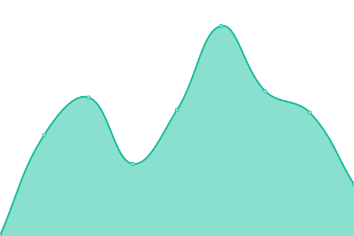

# [📈 Live Status](https://status.paion-data.dev): <!--live status--> **🟧 Partial outage**

This repository contains the open-source uptime monitor and status page for [Paion Data](https://nexusgraph.com/), powered by [Upptime](https://github.com/upptime/upptime).

With [Upptime](https://upptime.js.org), you can get your own unlimited and free uptime monitor and status page, powered entirely by a GitHub repository. We use [Issues](https://github.com/paion-data/service-status/issues) as incident reports, [Actions](https://github.com/paion-data/service-status/actions) as uptime monitors, and [Pages](https://status.paion-data.dev) for the status page.

<!--start: status pages-->
<!-- This summary is generated by Upptime (https://github.com/upptime/upptime) -->
<!-- Do not edit this manually, your changes will be overwritten -->
<!-- prettier-ignore -->
| URL | Status | History | Response Time | Uptime |
| --- | ------ | ------- | ------------- | ------ |
|  [paion-data.com](https://paion-data.com/) | 🟩 Up | [paion-data-com.yml](https://github.com/paion-data/service-status/commits/HEAD/history/paion-data-com.yml) | 

 1053ms
     
 | 

<a href="https://status.paion-data.dev/history/paion-data-com">100.00%</a>
    

|  [Tiger](https://huggingface.co/spaces/paion-data/tiger) | 🟥 Down | [tiger.yml](https://github.com/paion-data/service-status/commits/HEAD/history/tiger.yml) | 

 124ms
     
 | 

<a href="https://status.paion-data.dev/history/tiger">99.64%</a>
    

|  [Aristotle](https://paion-data-aristotle.hf.space/gradio_api/call/tts) | 🟩 Up | [aristotle.yml](https://github.com/paion-data/service-status/commits/HEAD/history/aristotle.yml) | 

 229ms
     
 | 

<a href="https://status.paion-data.dev/history/aristotle">100.00%</a>
    

|  [Lamassu](https://paion-data-lamassu.hf.space/gradio_api/call/predict) | 🟩 Up | [lamassu.yml](https://github.com/paion-data/service-status/commits/HEAD/history/lamassu.yml) | 

 231ms
     
 | 

<a href="https://status.paion-data.dev/history/lamassu">100.00%</a>
    

|  [Wiktionary Data](https://huggingface.co/datasets/paion-data/wiktionary-data) | 🟥 Down | [wiktionary-data.yml](https://github.com/paion-data/service-status/commits/HEAD/history/wiktionary-data.yml) | 

 143ms
     
 | 

<a href="https://status.paion-data.dev/history/wiktionary-data">99.64%</a>
    

|  [UI Component Library](https://ui.paion-data.com/) | 🟩 Up | [ui-component-library.yml](https://github.com/paion-data/service-status/commits/HEAD/history/ui-component-library.yml) | 

 460ms
     
 | 

<a href="https://status.paion-data.dev/history/ui-component-library">100.00%</a>
    

|  [FastUI](https://fastui.paion-data.com/) | 🟩 Up | [fast-ui.yml](https://github.com/paion-data/service-status/commits/HEAD/history/fast-ui.yml) | 

 407ms
     
 | 

<a href="https://status.paion-data.dev/history/fast-ui">100.00%</a>
    

|  [FastSpring](https://fastspring.paion-data.com/) | 🟩 Up | [fast-spring.yml](https://github.com/paion-data/service-status/commits/HEAD/history/fast-spring.yml) | 

 394ms
     
 | 

<a href="https://status.paion-data.dev/history/fast-spring">100.00%</a>
    

|  [Chatbot WS](https://chatbot.paion-data.com/) | 🟩 Up | [chatbot-ws.yml](https://github.com/paion-data/service-status/commits/HEAD/history/chatbot-ws.yml) | 

 465ms
     
 | 

<a href="https://status.paion-data.dev/history/chatbot-ws">100.00%</a>
    

|  [hashistack](https://hashistack.paion-data.dev/) | 🟩 Up | [hashistack.yml](https://github.com/paion-data/service-status/commits/HEAD/history/hashistack.yml) | 

 237ms
     
 | 

<a href="https://status.paion-data.dev/history/hashistack">100.00%</a>
    

|  [Paion Data API Gateway](https://api.paion-data.dev/wilhelm/languages/german?perPage=100&page=1) | 🟩 Up | [paion-data-api-gateway.yml](https://github.com/paion-data/service-status/commits/HEAD/history/paion-data-api-gateway.yml) | 

 1023ms
     
 | 

<a href="https://status.paion-data.dev/history/paion-data-api-gateway">83.68%</a>
    

|  [Paion Data Corp Mail Service](https://mail.paion-data.dev/) | 🟩 Up | [paion-data-corp-mail-service.yml](https://github.com/paion-data/service-status/commits/HEAD/history/paion-data-corp-mail-service.yml) | 

 331ms
     
 | 

<a href="https://status.paion-data.dev/history/paion-data-corp-mail-service">100.00%</a>
    

|  [(Team's Knowledge Hub) Documentation Guide](https://writethedocs.paion-data.dev/) | 🟩 Up | [team-s-knowledge-hub-documentation-guide.yml](https://github.com/paion-data/service-status/commits/HEAD/history/team-s-knowledge-hub-documentation-guide.yml) | 

 404ms
     
 | 

<a href="https://status.paion-data.dev/history/team-s-knowledge-hub-documentation-guide">100.00%</a>
    

|  [(Team's Knowledge Hub) Jest](https://jest.paion-data.dev/) | 🟩 Up | [team-s-knowledge-hub-jest.yml](https://github.com/paion-data/service-status/commits/HEAD/history/team-s-knowledge-hub-jest.yml) | 

 183ms
     
 | 

<a href="https://status.paion-data.dev/history/team-s-knowledge-hub-jest">100.00%</a>
    

|  [(Team's Knowledge Hub) Testcontainers for Java](http://testcontainers-java.paion-data.dev/) | 🟩 Up | [team-s-knowledge-hub-testcontainers-for-java.yml](https://github.com/paion-data/service-status/commits/HEAD/history/team-s-knowledge-hub-testcontainers-for-java.yml) | 

 164ms
     
 | 

<a href="https://status.paion-data.dev/history/team-s-knowledge-hub-testcontainers-for-java">100.00%</a>
    

|  [(Team's Knowledge Hub) Paion Data Docker Images](https://linuxserver.paion-data.dev/) | 🟩 Up | [team-s-knowledge-hub-paion-data-docker-images.yml](https://github.com/paion-data/service-status/commits/HEAD/history/team-s-knowledge-hub-paion-data-docker-images.yml) | 

 232ms
     
 | 

<a href="https://status.paion-data.dev/history/team-s-knowledge-hub-paion-data-docker-images">100.00%</a>
    

|  [(Team's Knowledge Hub) Git](https://git.paion-data.dev/) | 🟩 Up | [team-s-knowledge-hub-git.yml](https://github.com/paion-data/service-status/commits/HEAD/history/team-s-knowledge-hub-git.yml) | 

 1088ms
     
 | 

<a href="https://status.paion-data.dev/history/team-s-knowledge-hub-git">100.00%</a>
    

<!--end: status pages-->

[**Visit our status website →**](https://status.paion-data.dev)

## 📄 License

- Powered by: [Upptime](https://github.com/upptime/upptime)
- Code: [MIT](./LICENSE) © [Anand Chowdhary](https://anandchowdhary.com), supported by [Pabio](https://pabio.com)
- Data in the `./history` directory: [Open Database License](https://opendatacommons.org/licenses/odbl/1-0/)
